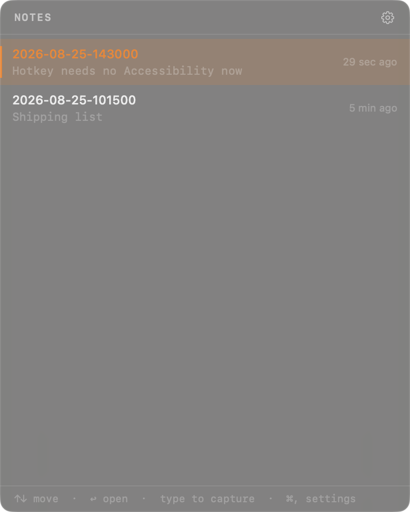
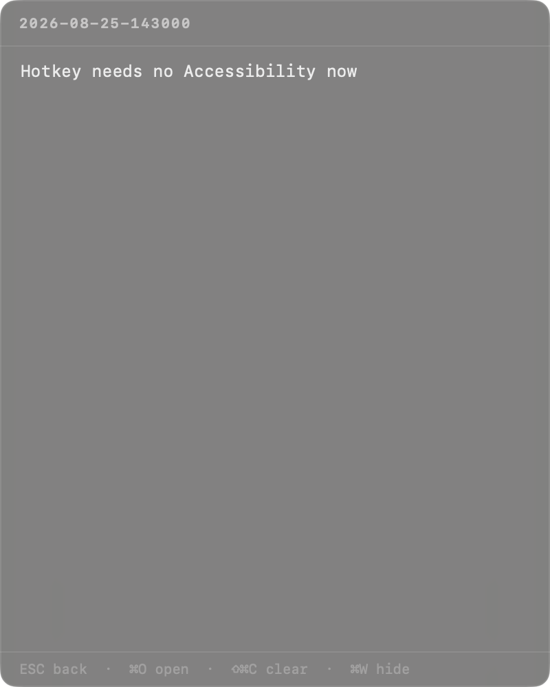
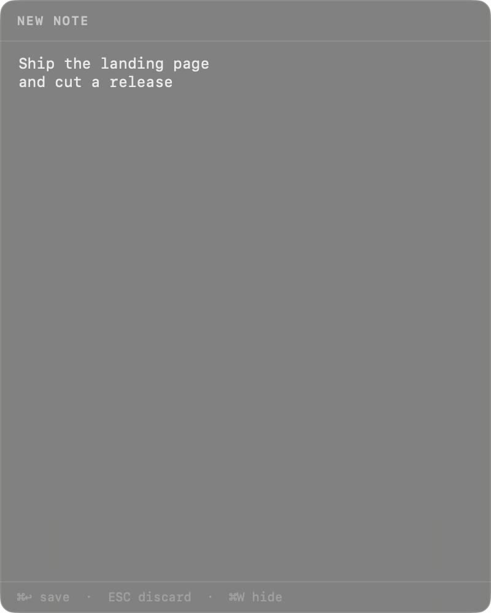
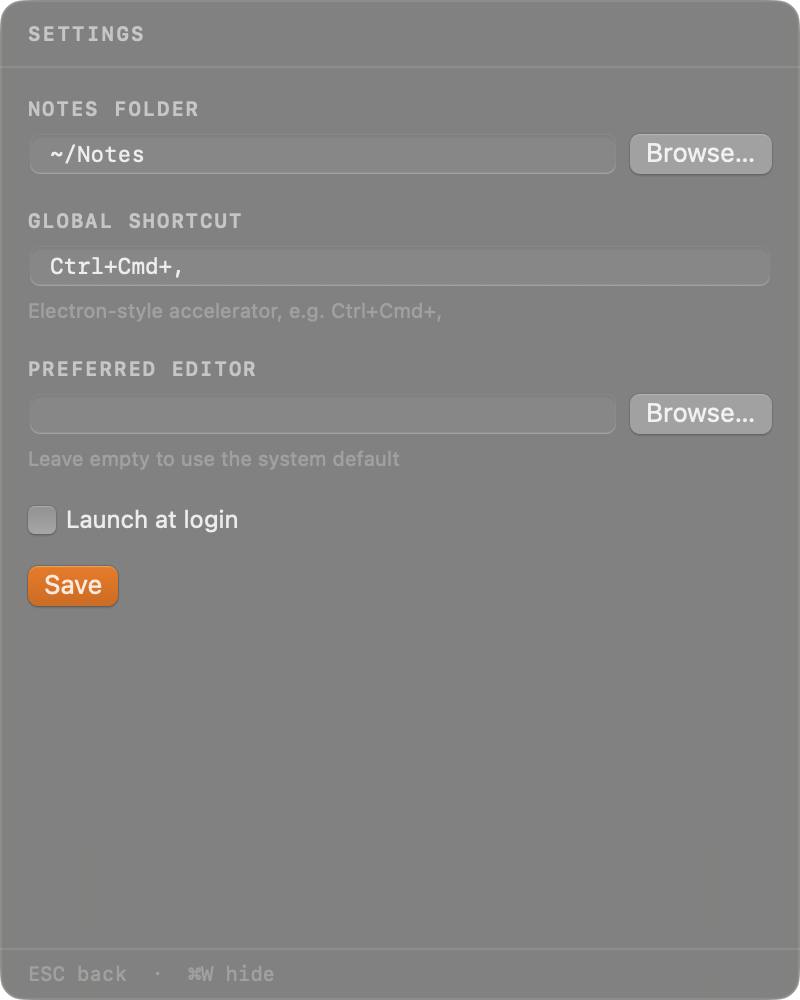

# FastBall

**Quick markdown capture, one keystroke away. Gotta Catch 'Em All!**

A macOS menubar app that puts a note window in front of you from anywhere, and gets out of
the way the moment you're done. Native Swift — AppKit + SwiftUI, zero dependencies, a
~480 KB binary.



## The whole idea

1. **Press `Ctrl+Cmd+,`** from any app. The window appears centred on whichever screen your
   cursor is on.
2. **Just start typing.** Any printable key drops you into a new note, seeded with what you
   typed. There's no "New Note" button to find.
3. **Press `Cmd+Enter`.** The note is written to disk as plain markdown and the window
   disappears.

## Features

- **Type-to-capture.** From the list, the first character you press starts the note.
  `Cmd+V` starts one from the clipboard.
- **Plain markdown files.** Notes are `.md` files named `YYYY-MM-DD-HHmmss.md` in a folder
  you choose. No database, no lock-in — point Obsidian at the same folder.
- **No Accessibility permission.** The hotkey is registered through Carbon, not an event
  tap, so macOS grants it without sending you to System Settings.
- **Auto-saving editor.** Edits are written half a second after you stop typing, and
  flushed when you leave the note. `Cmd+O` hands the file to your real editor when you
  need more room.
- **Stays out of the way.** No Dock icon, no app-switcher entry. A `✎` in the menu bar, and
  a borderless floating panel that hides itself the instant it loses focus.
- **Follows the system appearance.** Light and dark, with a translucent panel material.
- **Browse notes** sorted by most recently modified, with a one-line preview of each.
- **Settings** for the notes folder, the global shortcut, your preferred editor, and
  launch-at-login. A shortcut that can't be registered is rejected and the previous one
  restored, so you can't lock yourself out.

## Screenshots

| | |
|---|---|
|  |  |
|  |  |

## Requirements

macOS 14 (Sonoma) or later, Apple silicon or Intel. The Command Line Tools are enough to
build it — Xcode is not required.

No Accessibility permission is needed. The hotkey goes through Carbon's
`RegisterEventHotKey` rather than a global event tap, which is what would otherwise trigger
the permission prompt.

## Installation

### From source

```bash
git clone https://github.com/hernanflores/fastball
cd fastball
make run
```

### Build a .dmg

```bash
make dmg
```

The `.dmg` appears in `build/`.

## Default Keybindings

`Cmd+W` hides the window from any view, and `Cmd+Q` quits. The standard edit shortcuts
(`Cmd+Z`, `Shift+Cmd+Z`, `Cmd+X`, `Cmd+C`, `Cmd+V`, `Cmd+A`) work inside the text views.

### Global

| Shortcut | Action |
|---|---|
| `Ctrl+Cmd+,` | Toggle the FastBall window |

### List View

| Shortcut | Action |
|---|---|
| `↑` / `↓` | Navigate notes |
| `Enter` | Open selected note |
| any printable key | Start a new note seeded with that character |
| `Cmd+V` | Start a new note from the clipboard |
| `Cmd+,` | Settings |

### Editor View

| Shortcut | Action |
|---|---|
| `Esc` | Save and go back to the list |
| `Cmd+O` | Open in your preferred editor |
| `Shift+Cmd+C` | Clear the note |

### Capture View

| Shortcut | Action |
|---|---|
| `Cmd+Enter` | Save and hide |
| `Esc` | Discard |

### Settings View

| Shortcut | Action |
|---|---|
| `Return` | Save |
| `Esc` | Back to the list |

The app is keyboard-first but not keyboard-only: clicking a row opens that note, the gear
in the list header opens Settings, and left-clicking the menu bar icon toggles the window.

## Configuration

`~/Library/Application Support/FastBall/config.json`, created on first run:

```json
{
  "notesFolder": "~/Notes",
  "globalShortcut": "Ctrl+Cmd+,",
  "preferredEditor": ""
}
```

- `notesFolder` — `~` is stored literally and expanded when read. The folder is created if
  it's missing.
- `globalShortcut` — an accelerator string: `Cmd`, `Ctrl`, `Alt`/`Option` and `Shift`
  joined with `+`, then a key (a letter, a digit, punctuation, `Space`, `Return`, `Tab`,
  an arrow, or `F1`–`F12`).
- `preferredEditor` — a `.app` bundle or a CLI binary. Leave it empty to use whatever
  macOS opens `.md` files with.

Launch-at-login isn't stored here; it's registered with macOS through `SMAppService` and
toggled from Settings.

Notes are plain `.md` files named `YYYY-MM-DD-HHmmss.md`; two captures inside the same
second get a `-2`, `-3` suffix rather than overwriting each other. Whitespace-only captures
are discarded.

Right-click (or Ctrl-click) the menu bar icon for **Open Notes Folder**, **Settings**, and
**Quit FastBall**.

## Development

```text
FastBall/
├── main.swift                 NSApplication bootstrap
├── AppDelegate.swift          wiring: panel, status item, hotkey, key monitor, edit menu
├── AppState.swift             routes and note actions
├── KeyHandler.swift           the single keydown switch, per view
├── NotePanel.swift            borderless floating NSPanel, hide-on-blur, cursor-display centering
├── StatusItemController.swift the ✎ menu bar item and its right-click menu
├── HotKeyManager.swift        Carbon RegisterEventHotKey
├── Accelerator.swift          parses "Ctrl+Cmd+," accelerator strings
├── Config.swift               config.json read/write
├── NoteStore.swift            the .md files on disk
├── SelfTest.swift             synthesized-NSEvent smoke test
└── Views/                     SwiftUI views + theme

docs/                          the GitHub Pages landing page (index.html, style.css, img/)
```

### Make targets

| Target | Effect |
|---|---|
| `make` | Build `build/FastBall.app` |
| `make run` | Build, kill any running copy, and launch |
| `make test` | Build and run the keyboard-routing smoke test; fails unless it reports `ALL PASSED` |
| `make dmg` | Build `build/FastBall.dmg` |
| `make sign` | Re-apply the ad-hoc signature (the build does this for you) |
| `make clean` | Remove `build/` |

The ad-hoc signature uses a stable identity on purpose: macOS remembers the global hotkey
and the login item per signature, so an unsigned rebuild would look like a brand new app
every time.

### Debug flags

Useful because the UI can otherwise only be reached by keyboard:

| Flag | Effect |
|---|---|
| `--show` | Show the panel immediately at launch |
| `--selftest` | Run the keyboard-routing smoke test, write `/tmp/fastball-selftest.txt`, quit |
| `--diag` | Write panel/app state to `/tmp/fb-diag.txt` |
| `--route=editor\|capture\|settings` | Open straight into a view (for screenshots); also writes the panel's window number to `/tmp/fb-window.txt` |

```bash
make test
```
